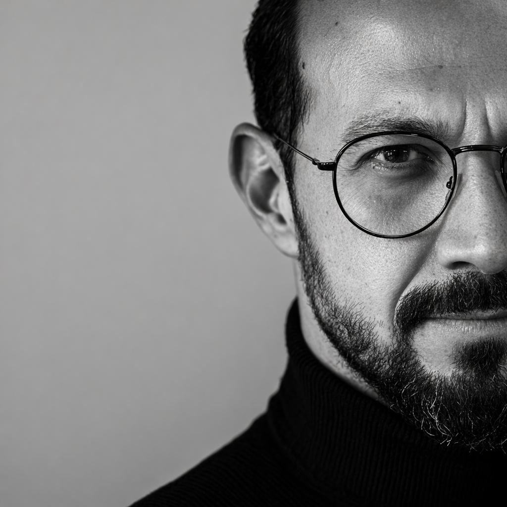

# The Human Toolkit for the AI Era

## 8 Practical Lessons to Build the Human Skills That Matter More as AI Gets Smarter

AI is getting better at writing, coding, analyzing, summarizing, and automating work.

The question is no longer whether AI can do more.

The question is: **what should humans get better at?**

This site explores eight practical skills that become more valuable as AI gets smarter.

::: buttons

::: button "Explore the 8 Lessons" href="#the-8-lessons" style="primary" size="large" :::

::: button "About the Talk" href="about.md" style="secondary" size="large" :::

:::

## The 8 Lessons

::: cards

::: card title="1. Think Before You Prompt" icon="🧠" href="lesson-1-think-before-you-prompt.md"
Good AI output starts with clear human thinking.
:::

::: card title="2. Ask Better Questions" icon="❓" href="lesson-2-ask-better-questions.md"
The quality of your questions often matters more than the sophistication of the tool.
:::

::: card title="3. Communicate With Clarity" icon="💬" href="lesson-3-communicate-with-clarity.md"
As AI produces more content, clear and direct communication becomes more valuable.
:::

::: card title="4. Develop Judgment" icon="⚖️" href="lesson-4-develop-judgment.md"
AI can generate options. You still need to decide what makes sense.
:::

::: card title="5. Stay Curious" icon="🔎" href="lesson-5-stay-curious.md"
Tools will change quickly. The ability to learn and adapt matters more than memorizing one platform.
:::

::: card title="6. Build Trust" icon="🤝" href="lesson-6-build-trust.md"
People still want to work with people they trust.
:::

::: card title="7. Protect Your Attention" icon="🎯" href="lesson-7-protect-your-attention.md"
AI can accelerate work, but constant automation and information can also create noise.
:::

::: card title="8. Keep the Human in the Loop" icon="👤" href="lesson-8-keep-the-human-in-the-loop.md"
Use AI to extend your abilities, not to outsource your responsibility.
:::

:::

## About the Talk

AI is getting better at writing, coding, analyzing information, generating ideas, and automating routine work.

That changes what people need to bring to the table.

**The Human Toolkit for the AI Era** explores eight practical skills that become more valuable as AI gets smarter: clear thinking, better questions, communication, judgment, curiosity, trust, attention, and human responsibility.

The goal is practical: use AI well without becoming passive users of it.

::: buttons

::: button "Learn More About the Talk" href="about.md" style="primary" size="large" :::

:::

## About the Speaker

::: columns

::: column

:::

::: column
### Cristobal Escobar

Cristobal Escobar works at Ortus Solutions, where he focuses on business development, marketing, partnerships, and helping organizations modernize legacy software and adopt new technologies.

His work sits at the intersection of technology, communication, sales, and strategy.

Over the years, he has worked with technical teams, universities, public institutions, and companies across different industries, helping turn complex ideas into practical projects.

This talk brings together lessons from technology, negotiation, communication, leadership, curiosity, and years of working with people through change.

::: buttons

::: button "LinkedIn" href="https://www.linkedin.com/in/cristobalescobarh/" style="primary" size="large" :::

::: button "Ortus Solutions Profile" href="https://www.ortussolutions.com/about-us/cristobal-escobar" style="secondary" size="large" :::

:::

:::

:::

## Start Here

The goal is simple: become better at the human skills that become more valuable as AI gets better.

